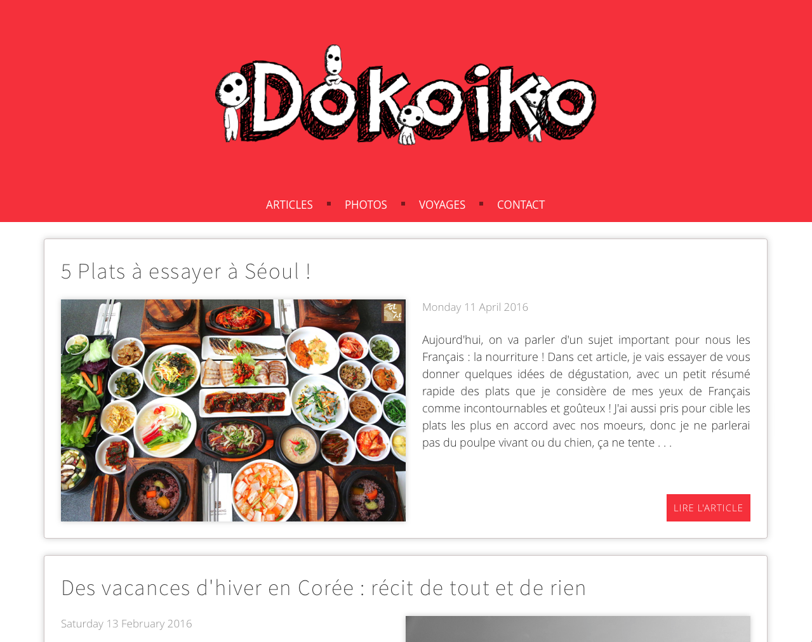
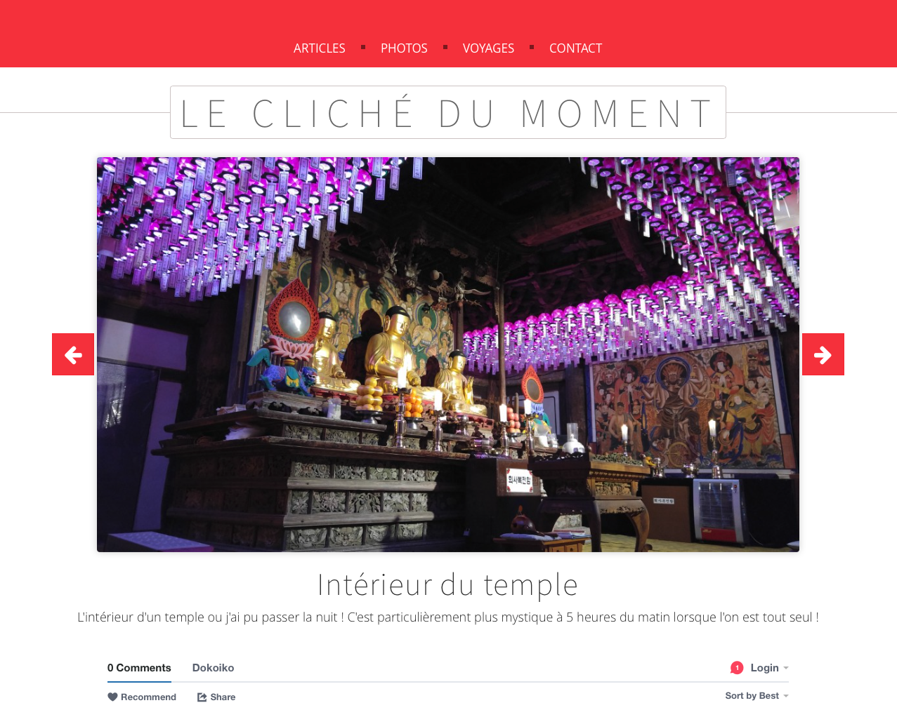
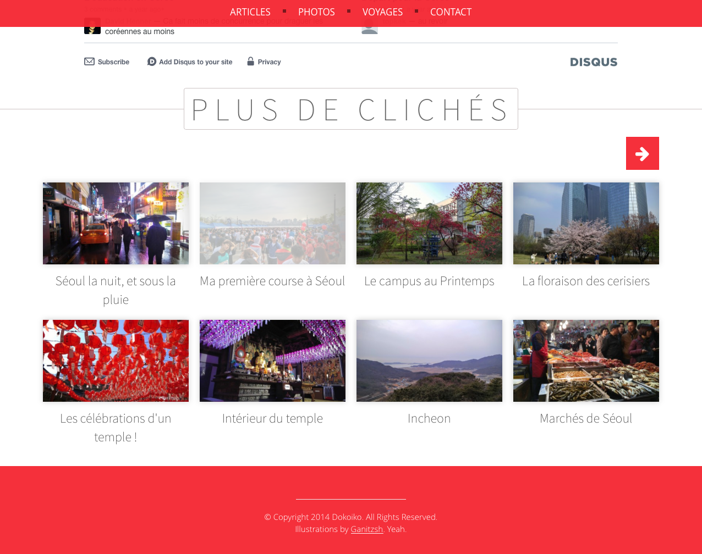
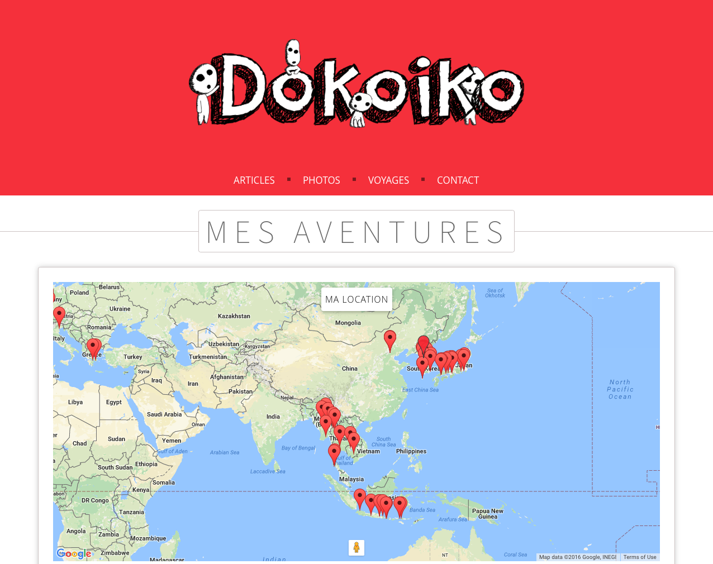

# Dokoiko

Dokoiko is a blogging project using Laravel MVC framework.
Currently working using **Laravel 5**.

It's free, and a nice way to share your stuff, why not ?

## Features implemented

Those are the main project features :

- Articles editing and publishing (thanks to the **Froala editor**). Write awesome stuff !
- Pictures publishing with a navigation grid. Share your best moments !
- Comments system using Disqus.
- Video publishing using the administrator Youtube account.
- Map markers showing the administrator travels. Show where you've been !
- Visitors mail sending. Get in touch !
- Multi-administrators system, for managing the blog together **#fun** !

Feel free to propose new features !

## Work in progress

Those features are currently in development (or planning to be) :

- Search bar. Get some stuff easily and quickly.
- Articles hashtags. Why not ?
- Better and easier personalisation features. It's open-source after all.
- NewsLetter, or RSS feed (still in discussion).
- English support. Because French is complicated.

# Deployment

After cloning the depot, setup the Laravel project and it's dependencies by using the Composer Package Manager :

```bash
composer install
```

*How to install Composer [here](https://getcomposer.org/doc/00-intro.md).*

Then download the other dependencies ~~(Again ?!)~~ by using the Node Package Manager :

```bash
sudo npm install
```

*How to install Npm [here](http://nodejs.org/download/).*

You can now compile the project stylesheets and moving the resources where they've to be.

```bash
gulp
```

Your brand new blog is now ready almost ready ! Setup your database by editing the `/config/database.php` file (depending of which database you use).

```php
	'host'      => env('DB_HOST') ?: 'your server goes here',
	'database'  => env('DB_DATABASE') ?: 'database name',
	'username'  => env('DB_USERNAME') ?: 'username',
	'password'  => env('DB_PASSWORD') ?: 'password',
```

Finally, setup your database tables by running :

```bash
php artisan migrate
```

Enjoy using Dokoiko !

# Design and preview

### Home Page


### Pictures Page





### Article reading Page


### Travels Page

