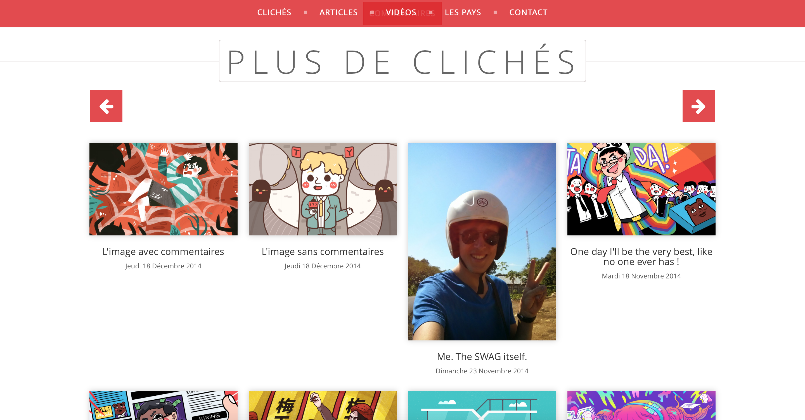
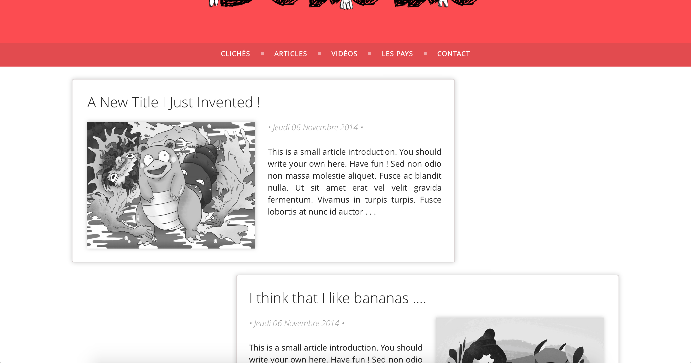
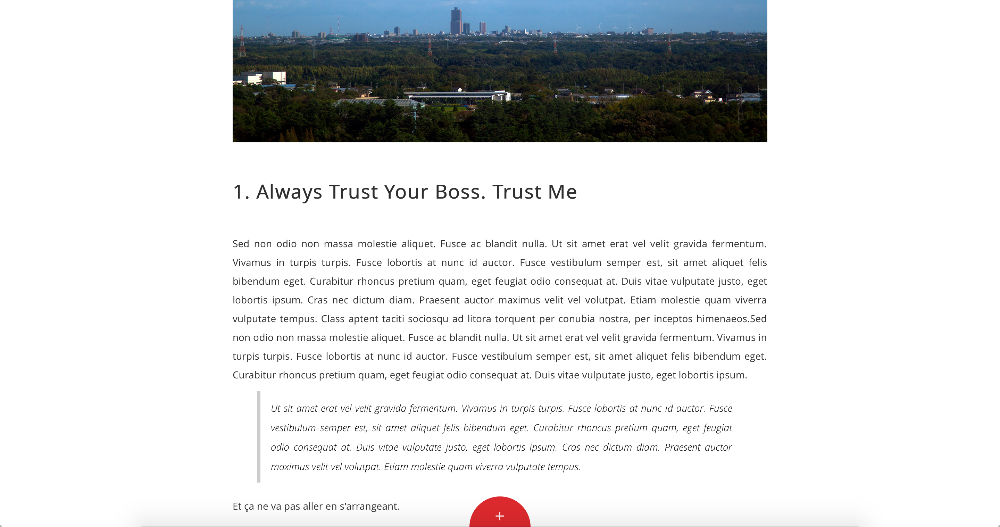
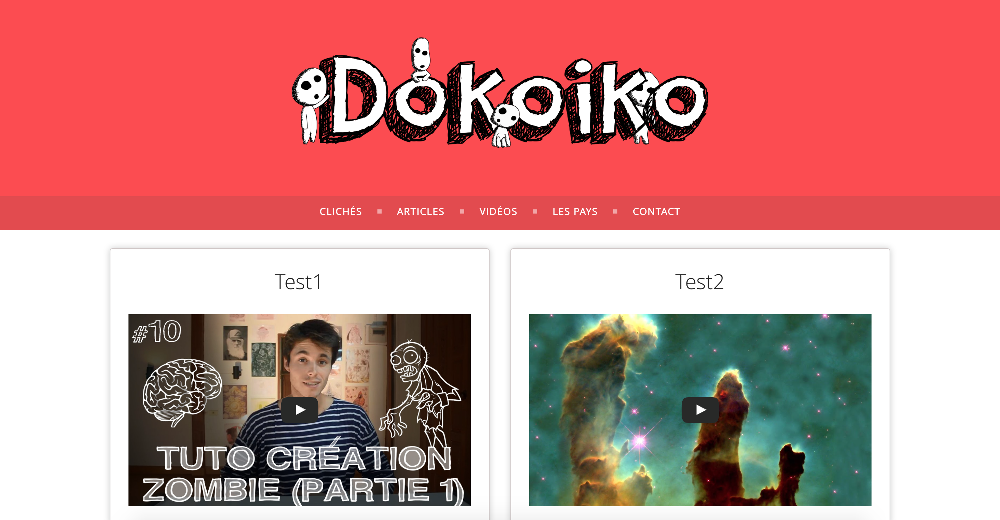

# Dokoiko

Dokoiko is a blogging project using Laravel MVC framework. Actually under Laravel 4.2, I'm currently upgrading it to Laravel 5.

## Features implemented

For the moment the project includes :
    - Articles editing and publishing
    - Pictures publishing, with a navigation grid
    - Video publishing, using the user's Youtube account
    - Readers mail sending
    
## Work in progress

Currently under developpement using Laravel 5, the following features are to be implemented soon :
    - Multi-administrators system, with different privileges
    - Sass stylesheets, with better and easier personalisation features
    - NewsLetter, or RSS feed (still in discussion)
    - English support
    - Unit testing, and deployment features using gulp
    
## Design and preview

Here's the current project appearance :

## 1. Pictures navigation

## 2. Article reader and menu

## 3. Videos

